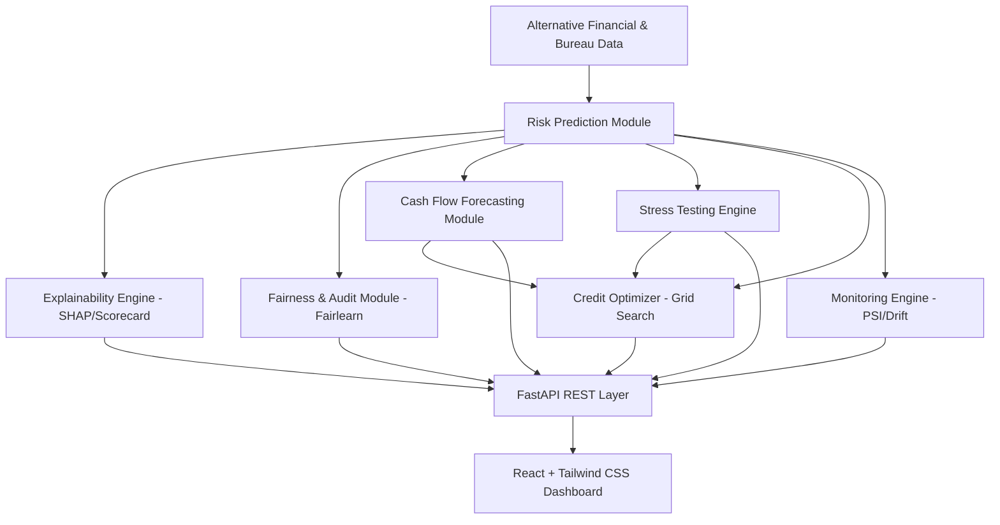

# CreditLens-MSME Architecture & System Design

## 🏛️ System Overview

CreditLens-MSME is designed as a modular decision-support system. It decouples core analytics, risk scoring, explainability, stress testing, fairness evaluation, and credit optimization from the interactive dashboard interface.

## 🔄 Core Workflow

1. **Synthetic Data Ingestion**: ~800 MSME borrower records + 12-month historical cash flows.
2. **Probability of Default (PD) Calculation**: Calibrated Logistic Scorecard + XGBoost Challenger.
3. **Explainability**: Top risk drivers (positive & negative), reason codes, counterfactual guidance.
4. **Cash Flow & Forecasting**: DSCR (Debt Service Coverage Ratio), cash runway, coverage, and downside risk metrics.
5. **Fairness Audit**: Disparate Impact Ratio across gender, region, and thin-file status, with proxy bias mitigation.
6. **Macro Stress Testing**: Shock simulation across interest rates, demand, inflation, and receivable delays.
7. **Credit Optimizer**: Grid-search engine for restructured loans balancing borrower capacity and lender risk limits.
8. **Model Monitoring**: Track drift (PSI), calibration performance, and explanation stability.
